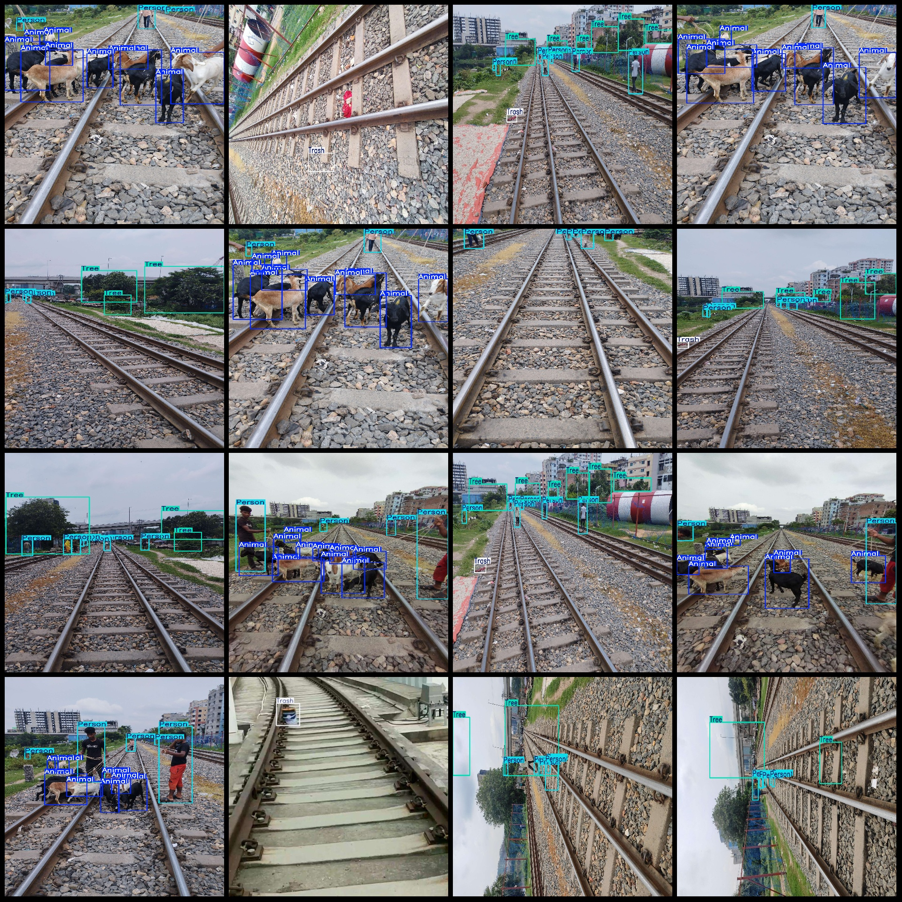
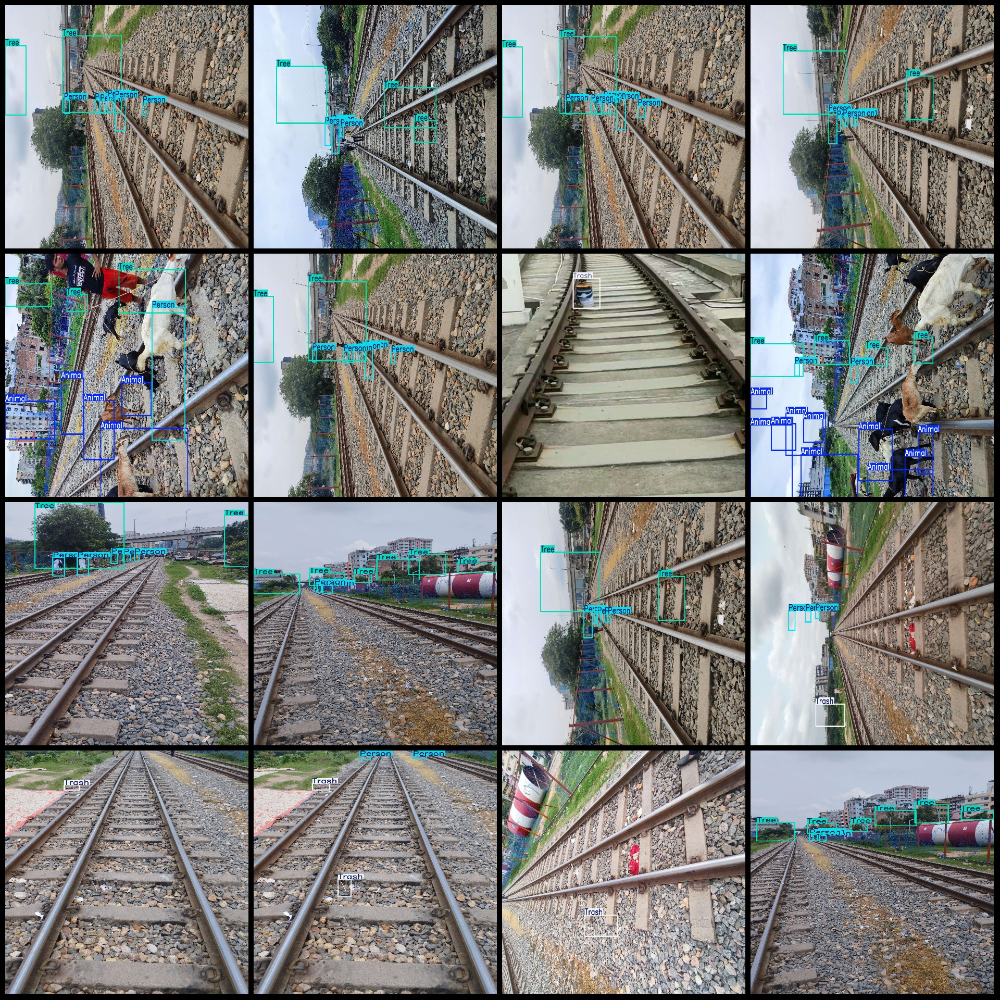

# Railway Track Safety Obstacle Detection Dataset VOC+YOLO format with 620 images and 6 categories

Dataset format: Pascal VOC format + YOLO format (excluding the split path in txt files, only including jpg images and corresponding VOC format xml files and YOLO format txt files)

Number of images (jpg file counts): 620
Number of annotations (xml file counts): 620
Number of annotations (txt file counts): 620
Number of annotation categories: 6
Annotation category names (notice that the order of categories in YOLO format does not correspond with this, but based on the labels folder's classes.txt): ["Animal", "Car", "Person", "Rock", "Trash",
 "Tree"]
Each category has a number of bounding boxes:
- Animal (animals) bounding box count = 1002
- Car (cars) bounding box count = 13
- Person (people) bounding box count = 2284
- Rock (rocks) bounding box count = 3
- Trash (trash) bounding box count = 231
- Tree (trees) bounding box count = 1149
Total bounding box count: 4682
Image resolution: Images are in multiple resolutions, such as 1920x1441, 1920x1440, etc.
Usage of labeling tool: labelImg
Labeling rules: Draw bounding boxes for each category
Important note: No guarantee is made regarding the accuracy of the trained model or weight files.
Image preview:
## Images

Here is a pay link on Stripe ( https://buy.stripe.com/3cs8yP7sY87d0vu9AB ). Please contact me lonlonago@foxmail.com after funding $89, and I will send you a complete data files , thank you!

